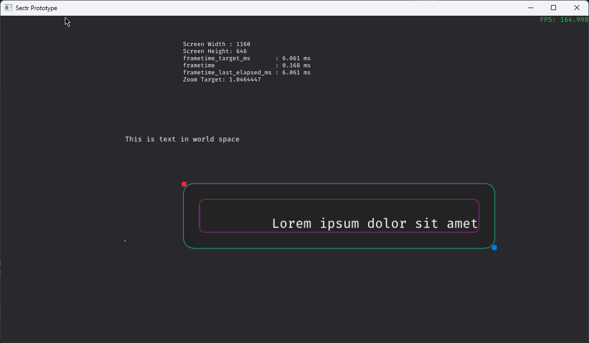
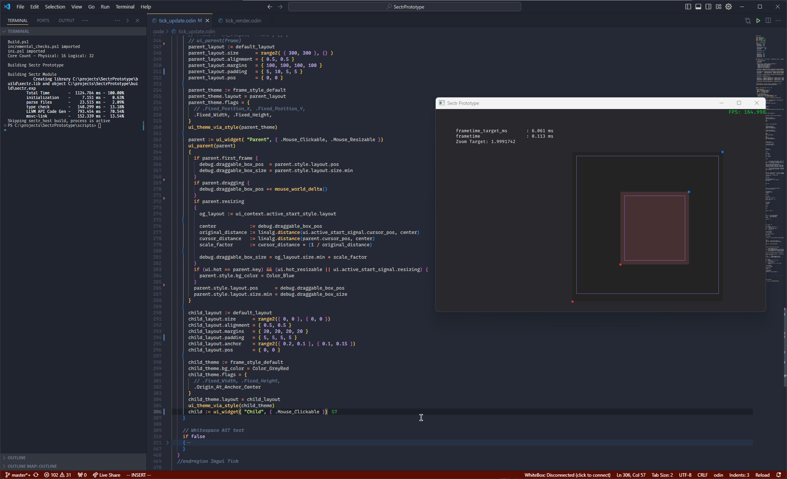
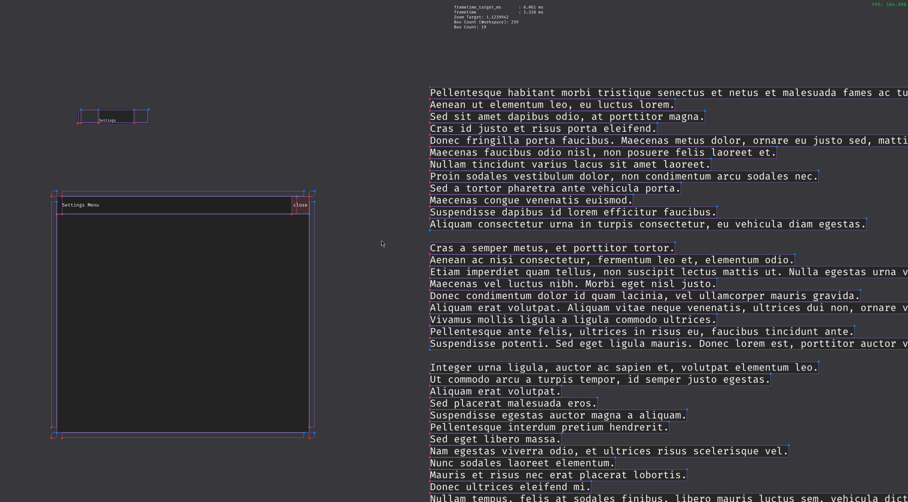
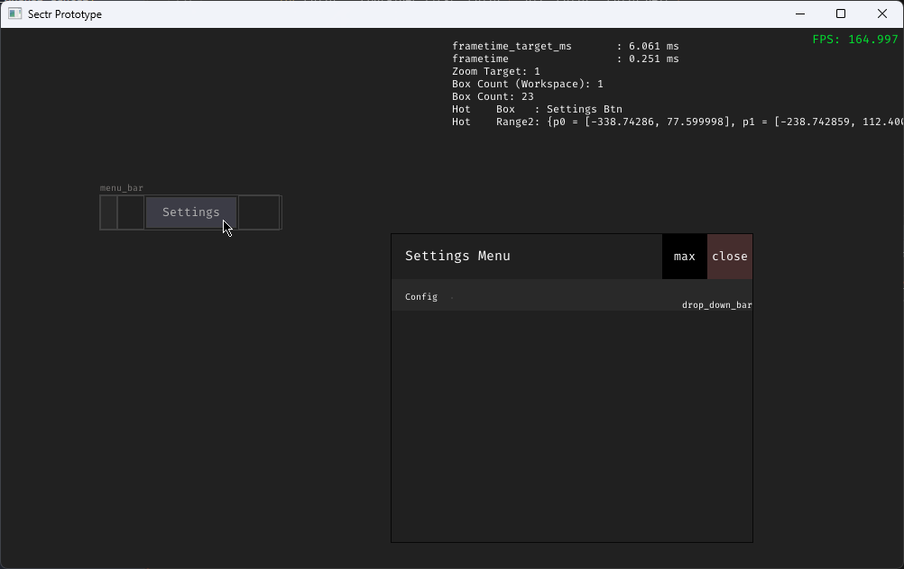

# Sectr Prototype

This prototype aims to flesh out ideas I've wanted to explore futher when it came to code editing and tools for code in general.

The things to explore:

* 2D canvas for laying out code visualized in various types of ASTs
* WYSIWYG frontend ASTs
* Making AST editing as versatile as text editing.
* High-performance generating a large amount of UI widget boxes with proper auto-layout & no perceptible rendering-lag or input lag for interactions (frametimes stable).
* Model-View-Controller interface between code managed by a 'backend' (both in memory and filesystem) and the UX composition (which has separate filesystem composition).

The project is so far in a "codebase boostrapping" phase.

The project's is organized into 2 modules sectr_host & sectr.
The host module loads the main module & its memory. Hot-reloading it's dll when it detects a change.

The dependencies are:

* Odin Compiler (Slightly custom)
  * Added #region, #endregion directives support for editors
* Odin repo's base, core, and vendor(raylib) libaries
* An ini parser
* backtrace
* Powershell (if you want to use my build scripts)

The client(sectr) module's organization is relatively flat due to the nature of odin's compiler, not allowing for cyclic dependencies across modules, and modules can only be in one directory.
This makes it difficult to unflatten, not something organic todo in a prototype...

I have the codebase by default in a non-idomatic layout that I stage to the compiler beforehand. There is a script(`scripts/gen_staged_compiler_codebase.ps1`) that stages a the idiomatic format of the codebase for the compiler to digest when `scripts/build.ps1` is run.

Major 'codebase modules':

* Engine : Main loop, logging, client interface for host, etc
  * Has the following definitions: startup, shutdown, reload, tick, clean_frame (which host hooks up to when managing the client dll)
* Env : Core Memory & State definition + orchestration
* Font Provider : Manages fonts.
  * When loading fonts, the provider currently uses raylib to generate bitmap glyth sheets for a range of font sizes at once.
  * Goal is to eventually render using SDF shaders.
* Grime : Name speaks for itself, stuff not directly related to the target features to iterate upon for the prototype.
  * Defining dependency aliases or procedure overload tables, rolling own allocator, data structures, etc.
* Input : All human input related features
  * Base input features (polling & related) are platform abstracted from raylib
  * Input Events
* Parser : AST generation, editing, and serialization. A 1/3 of this prototype will most likely be this alone.
* Project : Encpasulation of user config/state separate from persistent app config/state as a 'project'
  * Manages the codebase (program model database)
  * Manages workspaces : View compositions of the codebase
* UI : Core graphic user interface framework, AST visualzation & editing, backend visualization
  * Will most likely be the bulk of this prototype.
  * PIMGUI (Persistent Immediate Mode User Interface)
  * Auto-layout
  * Supports heavy procedural generation of box widgets

Due to the nature of the prototype there are 'sub-groups' such as the codebase being its own ordeal as well as the workspace.
They'll be elaborated in their own documentation

## Gallery

