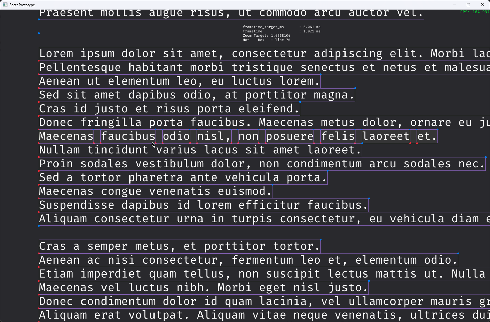

# Sectr Prototype

This prototype aims to flesh out ideas I've wanted to explore futher on code editing & related tooling.

The things to explore:

* 2D canvas for laying out code visualized in various types of ASTs
* WYSIWYG frontend ASTs
* Making AST editing as versatile as text editing.
* High-performance UI framework designed & built for AST editing.
* Generating a large amount of UI widget boxes with proper auto-layout & no perceptible rendering-lag or input lag for interactions (frametimes stable).
* Model-View-Controller interface between code managed by a 'backend' (both in memory and filesystem) and the UX composition (which has separate filesystem composition).

The project is so far in a "codebase boostrapping" phase.

The project's is organized into 2 modules sectr_host & sectr.
The host module loads the main module & its memory. Hot-reloading it's dll when it detects a change.

The dependencies are:

* Odin Compiler (Slightly custom [fork](https://github.com/Ed94/Odin))
  * Added #region, #endregion directives support for editors
  * I added support for 'monlithic packages' or 'uniform-across-subdirectories packages'. It allows me to organize the main package with sub-directories.
* Odin repo's base, core, and vendor(raylib) libaries
* An ini parser
* backtrace
* Powershell (if you want to use my build scripts)

Major 'codebase modules':

* App : General app config & contextual state
* Engine : client interface for host, tick, update, rendering.
  * Has the following definitions: startup, shutdown, reload, tick, clean_frame (which host hooks up to when managing the client dll)
  * Will handle async ops.
* Font Provider : Manages fonts.
  * Bulk of visualization must be able to render text effectively
  * Going to use some form of caching.
  * Needs to be able to scale text in-realtime to linear values.
* Grime : Name speaks for itself, stuff not directly related to the target features to iterate upon for the prototype.
  * Defining dependency aliases or procedure overload tables, rolling own allocator, data structures, etc.
* Input : All human input related features
  * Base input features (polling & related) are platform abstracted from sokol_app
  * Entirely user rebindable
* Parsers
  * AST generation, editing, and serialization.
  * Parsers for different levels of "synatitic & semantic awareness", Formatting -> Domain Specific AST
  * Figure out pragmatic transformations between ASTs.
* Project : Encpasulation of user config/context/state separate from persistent app's
  * Manages the codebase (database & model view controller)
  * Manages workspaces : View compositions of the codebase
* UI : Core graphic user interface framework, AST visualzation & editing, backend visualization
  * PIMGUI (Persistent Immediate Mode User Interface)
  * Auto-layout
  * Supports heavy procedural generation of box widgets
  * Viewports
  * Docking/Tiling, Floating, Canvas

Due to the nature of the prototype there are 'sub-groups' such as the codebase being its own ordeal as well as the workspace.
They'll be elaborated in their own documentation

## Gallery

